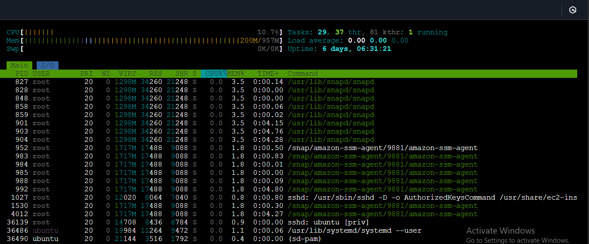
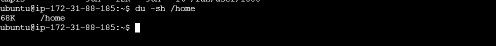
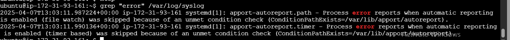
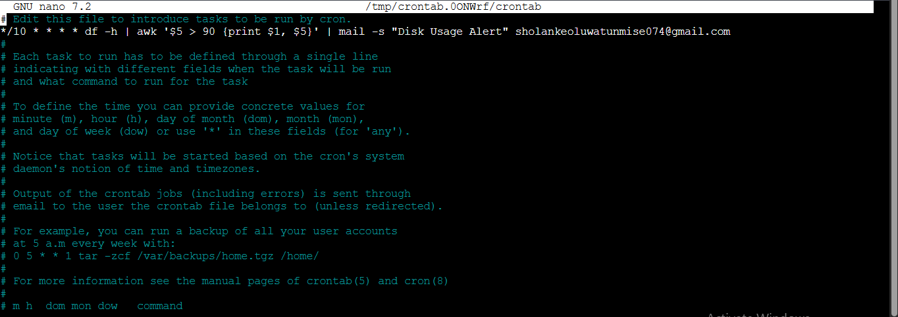
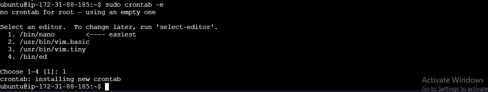
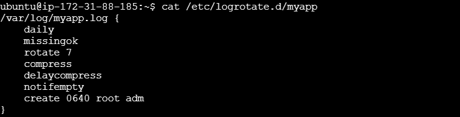

# system-monitoring

## Monitor System Performance
 # To monitor CPU, memory, and process usage, use
 sudo apt install htop

 
 htop
 

  # To check disk usage
   
   df -h
  
  
  du -sh /home
  

  # To search for specific entries in system logs
   
   grep "error" /var/log/syslog
  
  

   # To send alerts when disk usage exceeds 90%.
   
   sudo crontab -e
   
   